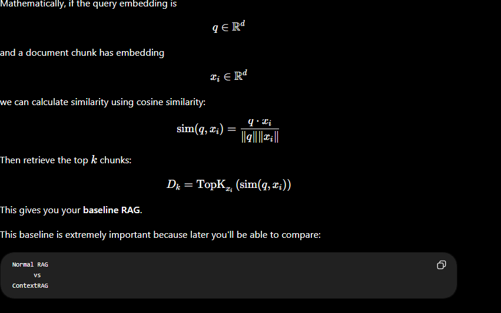
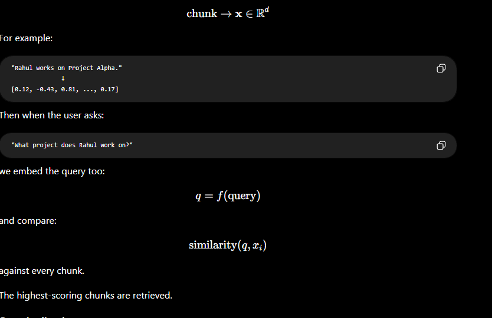

LangChain
   ↓
RAG components / document processing / integrations

LangGraph
   ↓
Agent workflow / state machine

ChromaDB
   ↓
Vector similarity search

Sentence Transformers
   ↓
Embedding generation

Neo4j
   ↓
Knowledge graph

PyPDF
   ↓
Read PDF documents

python-dotenv
   ↓
API keys / configuration

FastAPI
   ↓
Backend API

## Step 2 — Build the simplest RAG

Once ingestion works, implement:

Query
 ↓
Embedding
 ↓
Vector search
 ↓
Top-k chunks
 ↓
LLM
 ↓
Answer

## Step 2 — Embeddings

The goal is to turn every chunk into a numerical vector:

Our pipeline becomes
                    Documents
                        ↓
                     Chunking
                        ↓
              ┌─────────┴─────────┐
              ↓                   ↓
           Chunks             Query
              ↓                   ↓
          Embedding           Embedding
              ↓                   ↓
              └─────────┬─────────┘
                        ↓
                 Similarity Search
                        ↓
                     Top-k
                        ↓
                  Relevant chunks

## Step 3 — Vector Search

Our goal is:

User Query
    ↓
Query embedding
    ↓
Compare against all chunk embeddings
    ↓
Calculate similarity
    ↓
Sort by similarity
    ↓
Return Top-K chunks

## step 4 - entity extraction

Step 4 — Entity extraction

We first need to identify entities in each chunk.

For example:

Rahul Sharma is a Machine Learning Engineer.
Rahul currently works on the Atlas project.

should produce:

Entities:

Rahul Sharma      → PERSON
Machine Learning Engineer → ROLE
Atlas             → PROJECT
NovaTech          → COMPANY

But we don't want just a list of entities.

We also need their relationships.

### for this we do not use llm rather we go for graph based knoowledge
